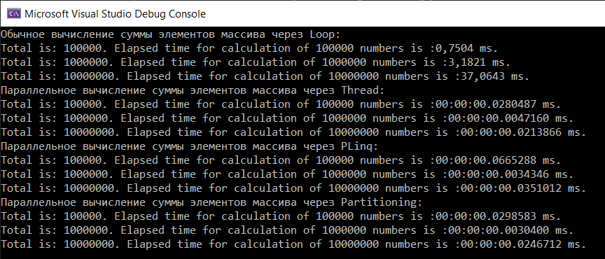

# OTUS C# Developer 2022-01

Content:
* [Student](#Student)
* [Module hw01 Подключение БД к проекту](#Module-hw01-db)
* [Module hw02 ДЗ "Добавляем взаимодействие между клиентом и сервером"](#Module-hw02-webapi)
* [Module hw04 ДЗ "Рефлексия и её применение"](#Module-hw04-reflection)
* [Module hw05 ДЗ "Делегаты и события"](#Module-hw05-delegates)
* [Module hw06 ДЗ "Параллельная загрузка данных из файла"](#Module-hw06-parallels)
* [Module hw07 ДЗ "Многопоточный проект"](#Module-hw07-inprocess-communication)
* [Module hw08 ДЗ "Реализуем паттерн 'Прототип'"](#Module-hw08-prototype)

# Student
`
Student: Vadim Lyulin
`

# Module hw01 Подключение БД к проекту <a name="Module-hw01-db"></a>
> Цель: научиться создавать базу данных с таблицами, а также писать скрипты наполнения таблиц данными. 
> А так же создавать приложение, способное получать данные из базы и добавлять новые.

1. Создан проект hw01.

2. В VS2022 добавлен Nuget package source (сразу почему-то не было), где расположена библиотека npg для работы с PostgreSQL.
Ссылка: https://api.nuget.org/v3/index.json


3. Добавлена библиотека  PostgreSQL/Npgsql provider for Entity Framework Core.


4. Добавлена библиотека Microsoft.EntityFrameworkCore

5. База данных установлена на heroku


8. Создано приложение с реализацией отношения many-to-many между сущностями Instructor и Course.

9. Создана миграция "Add-Migration InitialCreate" в Package Manager Console (PMC)
Меню: View > Other Windows > Package Manager Console
```
Install-Package Microsoft.EntityFrameworkCore.Tools
Add-Migration InitialCreate
```
Получаем ошибку
```
PM> Add-Migration Initial
Build started...
Build succeeded.
Your startup project 'hw01' doesn't reference Microsoft.EntityFrameworkCore.Design. This package is required for the Entity Framework Core Tools to work. Ensure your startup project is correct, install the package, and try again.
```
Добавлена библиотека EntityFrameworkCore.Design
После этого инициализация прошла нормально
```
PM> Add-Migration Initial
Build started...
Build succeeded.
The Entity Framework tools version '6.0.2' is older than that of the runtime '7.0.0-preview.1.22076.6'. Update the tools for the latest features and bug fixes. See https://aka.ms/AAc1fbw for more information.
To undo this action, use Remove-Migration.
PM> 
```

10. После генерации файла миграции для создания базы данных выполнена команда:
```
Update-Database
```
11. Создан скрипт создания таблиц для приложения hw01\DbScripts\create-tables.sql 

12. Создан скрипт наполнения таблиц hw01\DbScripts\dml.sql

13. Результат работы приложения


# Module hw02 ДЗ "Добавляем взаимодействие между клиентом и сервером" <a name="Module-hw02-webapi"></a>

> Задание
> 1. Создать эндпоинты в проекте WebApi
> 2. Доработать консольное приложение, чтобы оно удовлетворяло следующим требованиям:
>     1. Принимает с консоли ID "Клиента", запрашивает его с сервера и отображает его данные по пользователю;
>     2. Генерирует случайным образом данные для создания нового "Клиента" на сервере;
>     3. Отправляет данные, созданные в пункте 2.2., на сервер;
>     4. По полученному ID от сервера запросить созданного пользователя с сервера и вывести на экран.

1. Установлен .NET 6.0 Runtime (v6.0.3) для возможности запуска web-сервера
https://dotnet.microsoft.com/en-us/download/dotnet

2. В WebApi.csproj указал версию 6.0
```
<Project Sdk="Microsoft.NET.Sdk.Web">

    <PropertyGroup>
        <TargetFramework>net6.0</TargetFramework>
        <Platforms>AnyCPU;x64</Platforms>
    </PropertyGroup>
```

3. Репозиторий сделан примитивным с помощью List и сохранением/восстановлением данных в/из файла.
Так как при каждом REST запросе создается новый объект CustomerController и соответственно новый объект репозитория CustomerRepository.
Попытка сделать CustomerRepository в соответствии с паттерном Singleton не помогла.

4. Сделаны тест-кейсы (класс CustomersRepositoryTests) для проверки работоспособности репозитория.
Результат выполнения тест-кейсов:


5. Результат выполнения программы:


# Module hw04 ДЗ "Рефлексия и её применение" <a name="Module-hw04-reflection"></a>
> Задание: Написать свой класс-сериализатор данных любого типа в формат CSV, сравнение его быстродействия с типовыми механизмами серализации.
> Описание/Пошаговая инструкция выполнения домашнего задания:
> Основное задание:
> 1. Написать сериализацию свойств или полей класса в строку
> 2. Проверить на классе: class F { int i1, i2, i3, i4, i5; Get() => new F(){ i1 = 1, i2 = 2, i3 = 3, i4 = 4, i5 = 5 }; }
> 3. Замерить время до и после вызова функции (для большей точности можно сериализацию сделать в цикле 100-100000 раз)
> 4. Вывести в консоль полученную строку и разницу времен
> 5. Отправить в чат полученное время с указанием среды разработки и количества итераций
> 6. Замерить время еще раз и вывести в консоль сколько потребовалось времени на вывод текста в консоль
> 7. Провести сериализацию с помощью каких-нибудь стандартных механизмов (например в JSON)
> 8. И тоже посчитать время и прислать результат сравнения
> 9. Написать десериализацию/загрузку данных из строки (ini/csv-файла) в экземпляр любого класса
> 10. Замерить время на десериализацию
> 11. Общий результат прислать в чат с преподавателем в системе в таком виде: 
>     Сериализуемый класс: class F { int i1, i2, i3, i4, i5;} код сериализации-десериализации: ... 
>     количество замеров: 1000 итераций мой рефлекшен: Время на сериализацию = 100 мс 
>     Время на десериализацию = 100 мс стандартный механизм (NewtonsoftJson): Время на сериализацию = 100 мс Время на десериализацию = 100 мс

## Результат
Сериализуемый класс:
```
public class F
    {
        int i1, i2, i3, i4, i5;

        // public string str = "Str";
        public int prop { get; set; }

        int[] arr = new int[] { 1, 2, 3 };
        private G clazz { get; set; }

        public F Get() => new()
        {
            i1 = 1,
            i2 = 2,
            i3 = 3,
            i4 = 4,
            i5 = 5,
            clazz = new G()
        };
internal class G
    {
        [JsonInclude]
        int g1 = 1;
        [JsonInclude]
        int g2 = 2;

        public override string? ToString()
        {
            return "g1 = " + g1 + ", g2 = " + g2;
        }
    } 
```
код сериализации-десериализации: см.guthub  

* количество замеров: 100 итераций мой рефлекшен:  
>>Время на сериализацию = 0 минут 0 сек. 6 мс.  
>>Время на десериализацию = 0 минут 0 сек. 8 мс.   

* стандартный механизм (Newtonsoft.Json.JsonSerializer):  
>>Время на сериализацию = 0 минут 0 сек. 187 мс.   
>>Время на десериализацию = 0 минут 0 сек. 51 мс.  


# Module hw05 ДЗ "Делегаты и события" <a name="Module-hw05-delegates"></a>
> Задание: В этом задании требуется реализовать механизмы делегатов и событий для получения практического навыка их применения
> Описание/Пошаговая инструкция выполнения домашнего задания:
> 1. Написать обобщённую функцию расширения, находящую и возвращающую максимальный элемент коллекции. Функция должна принимать на вход делегат, преобразующий входной тип в число для возможности поиска максимального значения. public static T GetMax(this IEnumerable e, Func<T, float> getParameter) where T : class;
> 2. Написать класс, обходящий каталог файлов и выдающий событие при нахождении каждого файла;
> 3. Оформить событие и его аргументы с использованием .NET соглашений: public event EventHandler FileFound; FileArgs – будет содержать имя файла и наследоваться от EventArgs
> 4. Добавить возможность отмены дальнейшего поиска из обработчика;
> 5. Вывести в консоль сообщения, возникающие при срабатывании событий и результат поиска максимального элемента.

1. Код в папке hw05 
2. Резульат работы программы:


3. Результат выполнения тестов


# Module hw06 ДЗ "Параллельная загрузка данных из файла" <a name="Module-hw06-parallels"></a>
> Задание: Параллельная загрузка данных из файла
> Цель:
> 
> Сделать параллельный обработчик файла с данными клиентов на основе подготовленного проекта с архитектурой.
> Задание поможет отработать основные инструменты параллелизма на реалистичной задаче.
> Описание/Пошаговая инструкция выполнения домашнего задания:
> 
> Программа-обработчик должна в параллельном режиме обработать файл с данными клиентов.
> Каждая строка файла содержит:
> id (целое число)
> ФИО (строка),
> Email (строка)
> Телефон (строка).
> Данные отсортированы по id. Нужно десериализовать данные клиента в объект и передать объект в метод класса, который сохраняет его в БД, вместо сохранения в БД можно сделать просто задержку.
> Задания
> 
> 1. Запуск генератора файла через создание процесса, сделать возможность выбора в коде, как запускать генератор, процессом или через вызов метода. Если вдруг встретится баг с генерацией, то его нужно исправить и написать об этом при сдаче работы.
> 2. Распараллеливаем обработку файла по набору диапазонов Id, то есть нужно, чтобы файл разбивался на диапазоны по Id и обрабатывался параллельно через Thread, сколько диапазонов столько потоков. Хорошо сделать настройку с количеством потоков, чтобы можно было настроить оптимальное количество потоков под размер файла с данными. Предусмотреть обработку ошибок в обработчике и перезапуск по ошибке с указанием числа попыток. Проверить обработку на файле, в котором 1 млн. записей, при сдаче задания написать время, за которое был обработан файл и количество потоков.
> 3. Вместо создания потоков через new Thread() использовать ThreadPool, при сдаче задания написать время, за которое был обработан файл и количество потоков.
> 4. Добавить сохранение в реальную БД, можно SQL Lite для простоты тестирования или для лучшего понимания специфики загрузки полноценную базу данных (MS SQL Server, PostgreSQL, Mongo и т.д.)
> 5. Сделать обработку файла в CSV формате, то есть написать генератор и разбор файла.
> 6. Дать обратную связь по 2-м домашним заданиям других студентов на курсе. Инструкция
> 7. Сделать форк репозитория из ссылки в материалах, можно изменить структуру проектов, классов и интерфейсов, как считаете нужным и в ReadMe.md описать за что отвечает проект, класс, интерфейс.
> 8. Реализовать 1 пункт задания, сделав в main проекта запуск процесса-генератора файла, его нужно будет собрать отдельно и передать в программу путь к .exe файлу, также сделать в Main вызов кода генератора из подключенного проекта, выбор между процессом или вызовом метода сделать настройкой (например аргумент командной строки или файл с настройками) со значением по умолчанию для метода.
> 9. Реализовать 2 пункт задания, сделав свои реализации для IDataLoader и IDataParser.
> 10. По желанию реализовать 3 пункт задания, сделав дополнительную реализацию IDataLoader.
> 11. По желанию реализовать 4 пункт задания, сделав дополнительную реализацию для ICustomerRepository и инициализацию БД при старте приложения, можно использовать EF.
> 12. По желанию реализовать 5 пункт задания, сделав дополнительную реализацию для IDataParser и IDataGenerator.
> 13. По желанию дать обратную связь по 2-м домашним заданиям других студентов на курсе, можно найти репозитории по форкам к этому репозиторию. Обратную связь можно описать, создав issue к репозиторию, пример обратной связи можно посмотреть из ссылки на проект в материалах, который рассматривается в рамках занятия. Чтобы обратная связь была качественной обязательно нужно похвалить работу, написав, что сделано хорошо и написать, что можно улучшить с пояснениями почему это сделает работу более качественной. Эти рекомендации работают и для code review, так как позволяют более конструктивно обсуждать коммиты.

1. Пример запуска
data-loader.exe --genapp-path=.\data-generator.exe --method=task --quantity=100 --inrep-path=.\data\clients.csv --outrep-path=.\data\sqlite.dat --ntries=4

2. Описание параметров запуска
Usage: data-loader.exe --inrep-path=path --outrep-path=path [--genapp-path=path --method=function|task --quantity=int] [--help] [--ntries=int]
An interactive client for loading clients.
Options:
  inrep-path - path to input csv repository file.
  outrep-path - path to output SQLite repository file.
  genapp-path - path to generator exe file.
  method - method repository generation: by function or by task.
  quantity - quantity of records to be generated.
  ntries - number of tries of data loading.
  help - this help.

3. Результат выполнения тестов


Время генерации 1 млн. записей: 6.69 сек.  
Время загрузки 1 млн. записей: 14.49 сек.  

4. Описание классов и функций
>**_Note_**: сгенерировано с помощью проекта XmlCommentMarkDownGenerator

## data-loader ##

### Type SharedProject.Utils

 Сервисные функции 

---
#### Method SharedProject.Utils.CanCreateFile(System.String)

 Проверка возможности создания файла 

|Name | Description |
|-----|------|
|file: |путь и имя файла|
**Returns**: true - файл можут быть создан

---

## data-generator ##

### Type data_generator.ClientGenerator

 Реализация интерфейса IDataGenerator. Генерация объектов Client 

---
#### Method data_generator.ClientGenerator.Next

 Создание одного объекта типа Client 

**Returns**: 

---
#### Method data_generator.ClientGenerator.Next(System.Int32)

 Создание нескольких объектов типа Client 

|Name | Description |
|-----|------|
|count: |количество создаваемых объектов|
**Returns**: список сгенерированных объектов типа Client

---
#### Method data_generator.ClientGenerator.GetNewFIO

 Генерация произвольного ФИО 

**Returns**: сгенерированное ФИО

---
#### Method data_generator.ClientGenerator.GenerateName(System.Int32)

 Генерация строки похожей на фамилию, имя или отчество 

|Name | Description |
|-----|------|
|len: |длина генерируемой строки|
**Returns**: сгенерированная строка длины len

> https://stackoverflow.com/questions/14687658/random-name-generator-in-c-sharp 

---
#### Method data_generator.ClientGenerator.GetNewEmail(System.String)

 Генерация e-mail на основе имени и фамилии 

|Name | Description |
|-----|------|
|fio: |ФИО разделенные пробелом|
**Returns**: сгенерированный e-mail

---
#### Method data_generator.ClientGenerator.GetNewPhoneNumber

 Генерация номера телефона 

**Returns**: сгенерированный номер телефона

---
### Type data_generator.IDataGenerator

 Интерфейс генератора объектов типа T 

|Name | Description |
|-----|------|
|T: ||


---
#### Method data_generator.IDataGenerator.Next

 Создание одного объекта типа T 

**Returns**: экземпляр объекта с типом T

---
#### Method data_generator.IDataGenerator.Next(System.Int32)

 Создание нескольких объектов типа T 

|Name | Description |
|-----|------|
|count: |количество создаваемых объектов|
**Returns**: список сгенерированных объектов типа T

---

## repository ##

### Type DAL.Client

 Сущность Клиент 

---
### Type DAL.ClientCSVFileContext

 Реализация интерфейса IClientContext для работы с CSV репозиторием 

---
#### Method DAL.ClientCSVFileContext.#ctor(System.String,repository.DAL.ISerializer{repository.DAL.Client})

 Создание контекста для работы с CSV репозиторием 

|Name | Description |
|-----|------|
|fileName: |путь к CSV репозиторию|
|serializer: |CSV сериалайзер|
[[T:System.Exception|T:System.Exception]]: Ошибка создания/открытия CSV файла репозитория

---
#### Method DAL.ClientCSVFileContext.Open

 Открытие репозитория 

[[T:System.NotImplementedException|T:System.NotImplementedException]]: 

---
#### Method DAL.ClientCSVFileContext.Close

 Закрытие базы данных 

---
#### Method DAL.ClientCSVFileContext.BeginTransaction

 Начало транзакции 

[[T:System.NotImplementedException|T:System.NotImplementedException]]: 

---
#### Method DAL.ClientCSVFileContext.CommitTransaction

 Начало транзакции 

[[T:System.NotImplementedException|T:System.NotImplementedException]]: 

---
#### Method DAL.ClientCSVFileContext.RollbackTransaction

 Откат транзакции 

[[T:System.NotImplementedException|T:System.NotImplementedException]]: 

---
#### Method DAL.ClientCSVFileContext.Count

 Подсчет количества записей в CSV файле 

**Returns**: Число записей

---
#### Method DAL.ClientCSVFileContext.repository#DAL#IClientContext#Get(repository.DAL.IClientSpecification)

 Получение списка клиентов удовлетворяющих заданным условиям 

|Name | Description |
|-----|------|
|clientSpecification: |условия отбора записи|
**Returns**: список клиентов

---
#### Method DAL.ClientCSVFileContext.repository#DAL#IClientContext#Insert(repository.DAL.Client)

 Добавление нового клиента 

|Name | Description |
|-----|------|
|client: |добавляемый клиент|

---
#### Method DAL.ClientCSVFileContext.repository#DAL#IClientContext#Insert(System.Collections.Generic.IEnumerable{repository.DAL.Client})

 Добавление списка клиентов 

|Name | Description |
|-----|------|
|clients: |список клиентов|

---
### Type DAL.ClientCSVSerializer

 Сериализация/десериализация сущности "Клиент" в/из CSV формата 

---
#### Method DAL.ClientCSVSerializer.Serialize(repository.DAL.Client)

 Сериализация Client в CSV формат 

|Name | Description |
|-----|------|
|obj: |экземпляр типа Client|
**Returns**: 

---
#### Method DAL.ClientCSVSerializer.Deserialize(System.IO.StreamReader)

 Десериализация клиента из CSV формата в экземпляр Client 

|Name | Description |
|-----|------|
|stream: |поток bytes|
**Returns**: экземпляр типа Client

[[T:System.IO.IOException|T:System.IO.IOException]]: 

---
### Type DAL.ClientFileSpecification

 Реализация условия для отбора клиентов из CSV репозитория 

> шаблон проектирования "Спецификация" 

---
#### Method DAL.ClientFileSpecification.#ctor(System.Int64,System.Int64)

 Конструктор для создания условия отбора клиентов из CSV репозитория 

|Name | Description |
|-----|------|
|from: |начальный идентификатор диапазона отбора клиентов (включительно)|
|to: |конечный идентификатор диапазона отбора клиентов (включительно)|

---
#### Method DAL.ClientFileSpecification.IsSatisfiedBy(repository.DAL.Client)

 Проверка соответствия экземпляра Клиент заданным условиям 

|Name | Description |
|-----|------|
|client: |Клиент|
**Returns**: true, если клиент удовлетворяет заданным условиям

---
#### Method DAL.ClientSQLiteContext.SetConnection

 Получение соединения с SQLite базой данных 

**Returns**: 

---
#### Method DAL.ClientSQLiteContext.#ctor(System.String)

 Создание контекста для работы с CSV репозиторием 

|Name | Description |
|-----|------|
|fileName: |путь к SQLite репозиторию|
[[T:System.Exception|T:System.Exception]]: Ошибка создания/открытия SQLite файла репозитория

> В случае с пустой базой данных создаёт таблицу clients 

---
#### Method DAL.ClientSQLiteContext.Open

 Открытие репозитория 

---
#### Method DAL.ClientSQLiteContext.Close

 Закрытие базы данных 

[[T:System.NotImplementedException|T:System.NotImplementedException]]: 

---
#### Method DAL.ClientSQLiteContext.Count

 Подсчет количества записей в CSV файле 

**Returns**: Число записей Client в репозитории

[[T:System.NotImplementedException|T:System.NotImplementedException]]: 

---
#### Method DAL.ClientSQLiteContext.Get(repository.DAL.IClientSpecification)

 Получение списка клиентов удовлетворяющих заданным условиям 

|Name | Description |
|-----|------|
|clientSpecification: |условия отбора записи|
**Returns**: список клиентов

[[T:System.NotImplementedException|T:System.NotImplementedException]]: 

---
#### Method DAL.ClientSQLiteContext.Insert(repository.DAL.Client)

 Добавление нового клиента 

|Name | Description |
|-----|------|
|client: |добавляемый клиент|

---
#### Method DAL.ClientSQLiteContext.Insert(System.Collections.Generic.IEnumerable{repository.DAL.Client})

 Получение списка клиентов удовлетворяющих заданным условиям 

|Name | Description |
|-----|------|
|clientSpecification: |условия отбора записи|
**Returns**: список клиентов

---
#### Method DAL.ClientSQLiteContext.BeginTransaction

 Начало транзакции 

---
#### Method DAL.ClientSQLiteContext.CommitTransaction

 Подтверждение транзакции 

---
#### Method DAL.ClientSQLiteContext.RollbackTransaction

 Откат транзакции 

---
### Type DAL.IClientContext

 Интерфейс "Контекста" для работы с базой данных в соответстии с паттерном "Репозиторий" 

---
#### Method DAL.IClientContext.Open

 Открытие репозитория 

---
#### Method DAL.IClientContext.Close

 Закрытие репозитория 

---
#### Method DAL.IClientContext.Get(repository.DAL.IClientSpecification)

 Получение списка клиентов удовлетворяющих заданным условиям 

|Name | Description |
|-----|------|
|clientSpecification: |условия отбора записи|
**Returns**: список клиентов

---
#### Method DAL.IClientContext.Insert(repository.DAL.Client)

 Добавление нового клиента 

|Name | Description |
|-----|------|
|client: |добавляемый клиент|

---
#### Method DAL.IClientContext.Insert(System.Collections.Generic.IEnumerable{repository.DAL.Client})

 Получение списка клиентов удовлетворяющих заданным условиям 

|Name | Description |
|-----|------|
|clientSpecification: |условия отбора записи|
**Returns**: список клиентов

---
#### Method DAL.IClientContext.Count

 Подсчет количества записей в CSV файле 

**Returns**: Число записей Client в репозитории

---
#### Method DAL.IClientContext.BeginTransaction

 Создание транзакции 

---
#### Method DAL.IClientContext.CommitTransaction

 Подтверждение транзакции 

---
#### Method DAL.IClientContext.RollbackTransaction

 Откат транзакции 

---
### Type DAL.IClientSpecification

 Условия для отбора клиентов 

> шаблон проектирования "Спецификация" 

---
### Type DAL.ISerializer

 Интерфейс сериализации/десериализации 

|Name | Description |
|-----|------|
|T: ||

---
### Type Factory.CSVFileConfiguration

 Реализация интерфейса Конфигурация (IConfiguration) для работы с CSV репозиторием 

---
#### Method Factory.CSVFileConfiguration.#ctor(System.String)

 Конструктор конфигурации CSV репозитория 

|Name | Description |
|-----|------|
|repositoryPath: |путь к CSV репозиторию|

---
### Type Factory.CSVFileRepositoryCreator

 Создание CSV репозитория 

> Реализация раттерна "Фабричный метод" (Factory Method) 

---
#### Method Factory.CSVFileRepositoryCreator.CreateClientRepository(repository.Factory.IConfiguration)

 Создание CSV репозитория 

|Name | Description |
|-----|------|
|configuration: |Конфигурация CSV репозитория|
**Returns**: 

---
### Type Factory.IConfiguration

 Интерфейс конфигурация репозитория 

---
### Type Factory.RepositoryCreator

 Интерфейс фабрики создания репозитория 

> Паттерн "Фабричный метод" (Factory Method) 

---
#### Method Factory.RepositoryCreator.CreateClientRepository(repository.Factory.IConfiguration)

 Создание репозитория 

|Name | Description |
|-----|------|
|configuration: |Конфигурация репозитория|
**Returns**: 

---
### Type Factory.SQLiteConfiguration

 Реализация интерфейса Конфигурация (IConfiguration) для работы с SQLite репозиторием 

---
#### Method Factory.SQLiteConfiguration.#ctor(System.String)

 Конструктор конфигурации SQLite репозитория 

|Name | Description |
|-----|------|
|repositoryPath: |путь к SQLite репозиторию|

---
## Type Factory.SQLiteRepositoryCreator

 Создание SQLite репозитория 

> Реализация раттерна "Фабричный метод" (Factory Method) 

---
#### Method Factory.SQLiteRepositoryCreator.CreateClientRepository(repository.Factory.IConfiguration)

 Создание SQLite репозитория 

|Name | Description |
|-----|------|
|configuration: |Конфигурация SQLite репозитория|
**Returns**: 

---
### Type ClientRepository

 Реализация интерфейса IClientRepository 

---
#### Method ClientRepository.Open

 Открытие репозитория 

---
#### Method ClientRepository.Close

 Закрытие соединения с репозиторием 

---
#### Method ClientRepository.BeginTransaction

 Начало транзакции 

---
#### Method ClientRepository.CommitTransaction

 Подтверждение транзакции 

---
#### Method ClientRepository.RollbackTransaction

 Откат транзакции 

---
#### Method ClientRepository.Count

 Подсчет количества записей в CSV файле 

**Returns**: Число записей

---
#### Method ClientRepository.Get(repository.DAL.IClientSpecification)

 Получение списка клиентов удовлетворяющих заданным условиям 

|Name | Description |
|-----|------|
|clientSpecification: |условия отбора записи|
**Returns**: список клиентов

---
#### Method ClientRepository.Insert(repository.DAL.Client)

 Добавление нового клиента 

|Name | Description |
|-----|------|
|client: |добавляемый клиент|

---
#### Method ClientRepository.Insert(System.Collections.Generic.IEnumerable{repository.DAL.Client})

 Добавление списка клиентов 

|Name | Description |
|-----|------|
|clients: |список клиентов|

---
### Type IClientRepository

 Интерфейс репозитория для работы с сущностями Клиент 

> Шаблон проектирования "Репозиторий" 

---
#### Method IClientRepository.Open

 Открытие репозитория 

---
#### Method IClientRepository.Close

 Закрытие репозитория 

---
#### Method IClientRepository.Get(repository.DAL.IClientSpecification)

 Получение списка клиентов удовлетворяющих заданным условиям 

|Name | Description |
|-----|------|
|clientSpecification: |условия отбора записи|
**Returns**: список клиентов

---
#### Method IClientRepository.Insert(repository.DAL.Client)

 Добавление нового клиента 

|Name | Description |
|-----|------|
|client: |добавляемый клиент|

---
#### Method IClientRepository.Insert(System.Collections.Generic.IEnumerable{repository.DAL.Client})

 Добавление списка клиентов 

|Name | Description |
|-----|------|
|clients: |список клиентов|

---
#### Method IClientRepository.Count

 Подсчет количества записей в CSV файле 

**Returns**: Число записей

---
#### Method IClientRepository.BeginTransaction

 Создание транзакции 

---
#### Method IClientRepository.CommitTransaction

 Подтверждение транзакции 

---
#### Method IClientRepository.RollbackTransaction

 Откат транзакции 

---

# Module hw07 ДЗ "Многопоточный проект" <a name="Module-hw07-inprocess-communication"></a>
> Задание: Многопоточный проект
> Цель: Применение разных способов распараллеливания задач и оценка оптимального способа реализации.
> Описание/Пошаговая инструкция выполнения домашнего задания:
> 1. Напишите вычисление суммы элементов массива интов:
> - Обычное
> - Параллельное (для реализации использовать Thread, например List)
> - Параллельное с помощью LINQ
> 2. Замерьте время выполнения для 100 000, 1 000 000 и 10 000 000
> 3. Укажите в таблице результаты замеров, указав:
> - Окружение (характеристики компьютера и ОС)
> - Время выполнения последовательного вычисления
> - Время выполнения параллельного вычисления
> - Время выполнения LINQ Пришлите в чат с преподавателем помимо ссылки на репозиторий номера своих строк в таблице.

Результаты выполнения:



Обычное вычисление суммы элементов массива через Loop:  

|Количество|Время, мс.|
|---|---|
|100000|0,7504|
|1000000|3,1821|
|10000000|37,0643|

Параллельное вычисление суммы элементов массива через Thread:  

|Количество|Время, мс.|
|---|---|
|100000|:00:00:00.0280487|
|1000000|:00:00:00.0047160|
|10000000|:00:00:00.0213866|

Параллельное вычисление суммы элементов массива через PLinq:  

|Количество|Время, мс.|
|---|---|
|100000|:00:00:00.0665288|
|1000000|:00:00:00.0034346|
|10000000|:00:00:00.0351012|

Параллельное вычисление суммы элементов массива через Partitioning:  

|Количество|Время, мс.|
|---|---|
|100000|:00:00:00.0298583|
|1000000|:00:00:00.0030400|
|10000000|:00:00:00.0246712|

### Окружение 


# Module hw08 ДЗ "Реализуем паттерн 'Прототип'" <a name="Module-hw08-prototype"></a>
> Задание: Реализуем паттерн "Прототип"
> Цель: Создать иерархию из нескольких классов, в которых реализованы методы клонирования объектов по шаблону проектирования "Прототип".
> Описание/Пошаговая инструкция выполнения домашнего задания:
> 1. Придумать и создать 3-4 класса, которые как минимум дважды наследуются и написать краткое описание текстом.
> 2. Создать свой дженерик интерфейс IMyCloneable для реализации шаблона "Прототип".
> 3. Сделать возможность клонирования объекта для каждого из этих классов, используя вызовы родительских конструкторов.
> 4. Составить тесты или написать программу для демонстрации функции клонирования.
> 5. Добавить к каждому классу реализацию стандартного интерфейса ICloneable и реализовать его функционал через уже созданные методы.
> 6. Написать вывод: какие преимущества и недостатки у каждого из интерфейсов: IMyCloneable и ICloneable.

1. Создана иерархия классов соответствующая следующей слассификации рыб:


Диаграмма классов: 


Результаты выполнения:


Результаты прохождения тестов:


### Вывод

Преимущества интерфейса IMyCloneable:

- возвращает экземпляра того же типа соответствующий типу клонируемого экзепляра.

Недостатки интерфейса IMyCloneable:

- Так как интерфейс IMyCloneable - generic, приходится его имплементировать с трубекмым типом для каждого класса и скрывать соответствующие методы родителя в производном классе.

Преимущества интерфейса и IClonable:

- можно указать реализацию интерфейса только в родительском классе (реализация все-равно требуется в каждом классе).

Недостатки интерфейса IMyCloneable:

- возвращает экземпляр типа object и требуется явное приведение типов.
